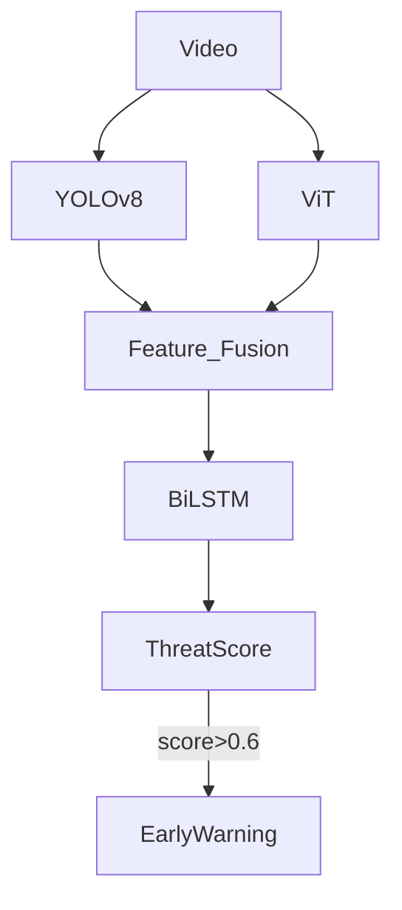

# TTSS Architecture

TTSS (Temporal Threat Scoring System) is a three-layer video understanding pipeline for continuous threat scoring on surveillance footage. The system fuses frame-level object recognition, scene-level semantic encoding, and temporal sequence modeling to estimate a threat score for each frame and raise an early warning when the score exceeds `0.6`.

## Mermaid Overview



## Layer Breakdown

### Recognition Layer

The recognition layer uses YOLOv8 to detect threat-relevant actors and objects from each frame. TTSS focuses especially on classes such as `person`, `car`, and `weapon`, while still allowing raw detector outputs to be mapped into these categories. The output of this layer is a per-frame detection dictionary:

```text
Dict[frame_id, List[Detection]]
```

Each detection contains bounding box coordinates, confidence, class label, and frame index. These detections are converted into compact numeric features such as object counts, confidence summaries, and approximate spatial footprint.

### Detection Layer

The detection layer uses ViT-B/16 to encode global scene context. Each frame is resized and normalized before passing through the ViT backbone, and the CLS token is used as the scene representation. This yields a scene embedding of shape `(batch, 768)`.

The scene embedding captures context that object detections alone may miss, such as road layout, store interior structure, crowd density, or unusual environmental conditions.

### Prediction Layer

The prediction layer consumes the fused sequence of recognition features and scene embeddings. The architecture consists of:

- an input projection layer
- a 2-layer bidirectional LSTM with hidden size `256`
- a temporal attention mechanism
- an output projection followed by sigmoid activation

This produces a frame-wise threat score in the range `[0, 1]`, along with an attention-weighted sequence summary score used for early warning decisions.

## Data Stream

The TTSS inference path is:

1. A video is loaded and split into frames.
2. YOLOv8 processes each frame and returns focused detections.
3. ViT-B/16 processes the same frames and returns CLS-token scene embeddings.
4. Recognition features and scene embeddings are concatenated into fused per-frame feature vectors.
5. The BiLSTM prediction head models temporal dependencies and emits threat scores.
6. Any frame with score `> 0.6` triggers the early warning signal.

## Temporal Labeling Scheme

TTSS uses a four-stage temporal labeling strategy for supervision:

- `normal`: all frames outside the threat windows, score `0.0`
- `pre_crime`: the `K` frames before the crime start, linearly increasing from `0.0` to `0.5`
- `crime`: the annotated anomaly interval, increasing from `0.5` to `1.0`
- `post_crime`: the `K` frames after the crime end, exponentially decreasing toward `0.0`

In the current implementation, the default pre-crime and post-crime windows are `90` frames, which is approximately `3` seconds at `30 FPS`. This labeling scheme supports both frame-wise regression and early-warning objectives.